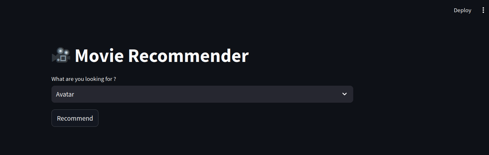

# Movie Recommender System
Model Link: https://huggingface.co/spaces/ujjwal-7531/Movie_Recommender

## Overview
This project is a movie recommender system built using Streamlit framework. It suggests movies based on user preferences, aiming to provide personalized movie recommendations. Is it based on content-based recommendation.
  
## Features

- **Personalized Recommendations**: Suggests movies based on your preferences.

- **Interactive UI**: Built with Streamlit for a seamless and engaging user experience.
  
## Insights and Skills Gained

- **Recommender Systems**: Acquired in-depth knowledge of collaborative filtering and content-based filtering approaches.

- **Streamlit for Web Applications**: Gained practical experience in creating interactive web applications with Streamlit.

- **Data Processing and Analysis**: Enhanced skills in data cleaning, processing, and analysis for accurate recommendations.

- **User Interface Design**: Improved the ability to create intuitive and user-friendly interfaces for a better user experience.
  
## Key Techniques Used

-  **Stemming**: Standardized words by reducing them to their root forms, ensuring consistency in text data.

-  **Stop Word Removal**: Eliminated common stop words to reduce noise and focus on significant terms.

-  **Tokenization**: Segmented text into manageable units for effective analysis.

-  **Bag of Words**: Transformed text into numerical representations for machine learning applications.

-  **Vectorization**: Converted textual data into high-dimensional vector representations to enable computational processing.

vi) Cosine Similarity: Measured textual similarity to enhance recommendation accuracy based on features.
  
  
## Visuals From The Project
- ### Interface

- ### Selecting From Dropbox

- ### Searching

- ### Result

  
## Technology Used
1. Python
2. Streamlit
3. Pandas
4. Numpy
5. NLTK (Natural Language Toolkit)
        
